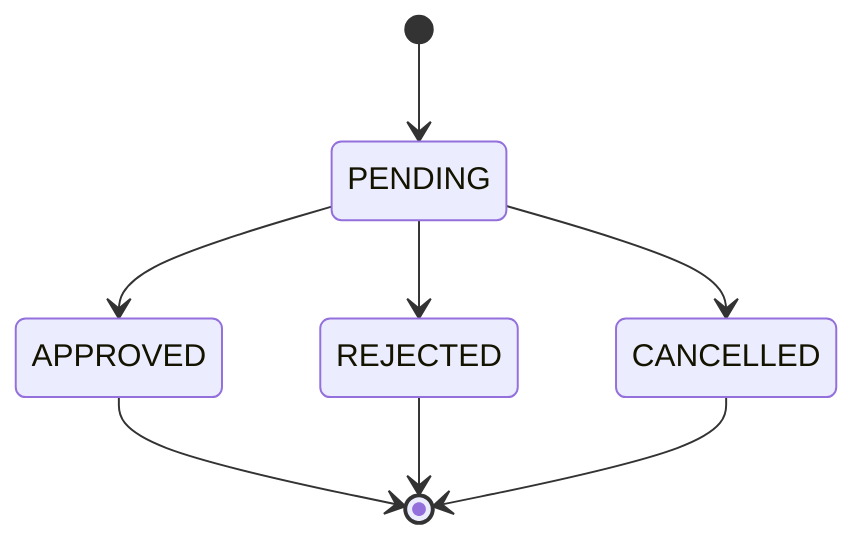

# Avaliação e Sugestões — Developer Challenge (Nível Júnior)

> Revisão de consistência da documentação do repositório.
> Considerações voltadas para candidatos desenvolvedores fullstack júnior.

---

## 1. Pontos fortes do desafio

- **Escopo bem delimitado:** O sistema de solicitações de compra é um domínio realista e autocontido, sem dependências externas complexas (pagamentos, integrações de terceiros, etc.).
- **Máquina de estados explícita:** A seção 4 é muito bem estruturada. A tabela de transições e o ênfase no HTTP 422 ensinam ao candidato um conceito importante de modelagem de regras de negócio.
- **Flexibilidade de stack:** Permitir Java ou Node.js + React ou Angular amplia o pool de candidatos sem comprometer a avaliação dos conceitos essenciais.
- **Critérios de avaliação ponderados e transparentes:** O candidato sabe exatamente o que será avaliado e com qual peso — isso reduz ansiedade e direciona o esforço.
- **Prazo razoável:** 2 dias corridos é adequado para um candidato júnior que precisará pesquisar e implementar do zero.

---

## 2. Ambiguidades e pontos de atenção

### 2.1 Definição de "APROVADOR sênior" (NIVEL_2) — CRÍTICO

O documento define:
> `NIVEL_2` — apenas **APROVADOR sênior** ou ADMIN

**Problema:** O sistema possui apenas um papel `APROVADOR`, sem distinção entre júnior e sênior. Não há instrução sobre como registrar ou identificar um aprovador como "sênior" no cadastro.

**Impacto:** Candidatos podem implementar soluções inconsistentes:
- Alguns criarão um campo `seniority` no usuário
- Outros criarão um papel `APROVADOR_SENIOR` separado
- Outros ignorarão a distinção e permitirão que qualquer APROVADOR aprove NIVEL_2

**Sugestão:** Esclarecer explicitamente se o nível do aprovador deve ser um campo no cadastro do usuário (ex: `approverLevel: NIVEL_1 | NIVEL_2`) ou se deve ser um papel separado (`APROVADOR_JUNIOR`, `APROVADOR_SENIOR`). Exemplo de clarificação no README:

> O nível do aprovador deve ser armazenado como um atributo do usuário com papel `APROVADOR`. No cadastro, informe `approverLevel: "NIVEL_1"` ou `"NIVEL_2"`.

---

### 2.2 Campo `category` sem valores definidos

O payload de exemplo usa `"category": "EQUIPMENT"`, mas não há uma lista de categorias válidas definida no documento.

**Impacto:** Candidatos podem tratar `category` como texto livre, ou inventar suas próprias listas de enum. Isso dificulta a padronização da avaliação.

**Sugestão:** Definir um enum sugerido de categorias, mesmo que simplificado:
```
EQUIPMENT | SERVICES | SUPPLIES | TRAVEL | OTHER
```
Ou deixar explícito que é texto livre e sem validação de enum.

---

### 2.3 Paginação sem parâmetros especificados

O requisito menciona "paginação" na listagem, mas não especifica os parâmetros esperados (`page`, `limit`, `offset`, `size`).

**Sugestão:** Adicionar exemplo mínimo:
```
GET /requests?status=PENDING&page=1&limit=10
```

---

### 2.4 Ausência de schema de banco sugerido

Candidatos júnior frequentemente têm dificuldade na modelagem de dados. A ausência de qualquer orientação pode resultar em modelos inconsistentes que não suportam as regras de negócio.

**Sugestão:** Não é necessário fornecer o schema completo — mas um diagrama ER simplificado ou uma lista das entidades principais (User, Request, ApprovalHistory) com seus campos-chave seria valioso como orientação sem "dar a resposta".

---

### 2.5 Histórico de ações — endpoint vs. campo na resposta

O endpoint `GET /requests/:id/history` retorna o histórico separadamente, mas a "Tela de detalhe" do front-end deve mostrar "dados da solicitação, status atual e **histórico de ações**".

**Potencial inconsistência:** O front-end precisará fazer 2 requisições (`GET /requests/:id` + `GET /requests/:id/history`) para renderizar a tela de detalhe. Isso é tecnicamente correto mas pode confundir candidatos que não percebem que o histórico não vem embutido na resposta do `GET /requests/:id`.

**Sugestão:** Deixar explícito se o histórico deve vir embutido na resposta de detalhe (`history: [...]`) ou se a tela deve fazer duas chamadas. Ambas são válidas, mas a escolha deve ser declarada.

---

### 2.6 Falta de instrução sobre o `.env.example`

O requisito 5.3 menciona "Variáveis de ambiente documentadas com exemplo (.env.example)", mas não lista quais variáveis são esperadas.

**Sugestão:** Adicionar uma lista mínima de variáveis esperadas:
```
DATABASE_URL=
JWT_SECRET=
JWT_EXPIRATION=
PORT=
```
Isso garante que o projeto seja rodável pelo avaliador sem adivinhações.

---

## 3. Sugestões de melhoria na documentação

### 3.1 Adicionar diagrama de estados

Um diagrama visual da máquina de estados seria muito útil para candidatos júnior, que podem ter dificuldade em interpretar a tabela de transições. Algo simples em Mermaid no próprio README seria suficiente:



---

### 3.2 Esclarecer "projetos sem README funcional serão desclassificados"

O documento menciona que o candidato deve criar um `README.md` com instruções. Porém, este repositório já tem um `README.md` com o enunciado — candidatos podem confundir o que criar.

A instrução no README do desafio já esclarece que o README deve ser criado **dentro de cada pasta** (`backend/` e `frontend/`). Isso está correto, mas seria bom reforçar que o `README.md` da raiz (este arquivo) não deve ser alterado.

---

### 3.3 Ausência de informação sobre o avaliador para contato

O documento original menciona "entre em contato antes de tomar decisões de design", mas não especifica por qual canal. Para o contexto de repositório Git, sugerir um canal (e-mail, GitHub Issues, etc.) evita que candidatos fiquem travados por dúvidas.

---

## 4. Avaliação geral de adequação para nível júnior

| Aspecto | Avaliação | Observação |
|---------|-----------|------------|
| Clareza do enunciado | Boa | Bem escrito e organizado |
| Escopo | Adequado | Desafiador mas executável em 2 dias |
| Ponto mais difícil | Atenção necessária | Regras de NIVEL_2 são ambíguas |
| Diferenciais opcionais | Bem posicionados | Não penaliza quem não implementa |
| Critérios de avaliação | Excelente | Transparentes e ponderados |
| Orientação técnica | Pode melhorar | Schema sugerido ajudaria muito |

**Conclusão:** O desafio está bem estruturado para avaliar desenvolvedores júnior fullstack. As principais melhorias recomendadas são: clarificar a distinção de nível do APROVADOR (item 2.1), definir o enum de categorias (item 2.2) e considerar um schema ER de referência (item 2.4). Essas mudanças reduziriam interpretações divergentes sem comprometer a avaliação das competências essenciais.
